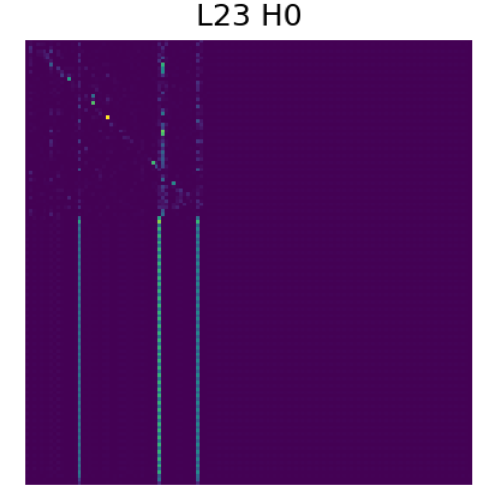
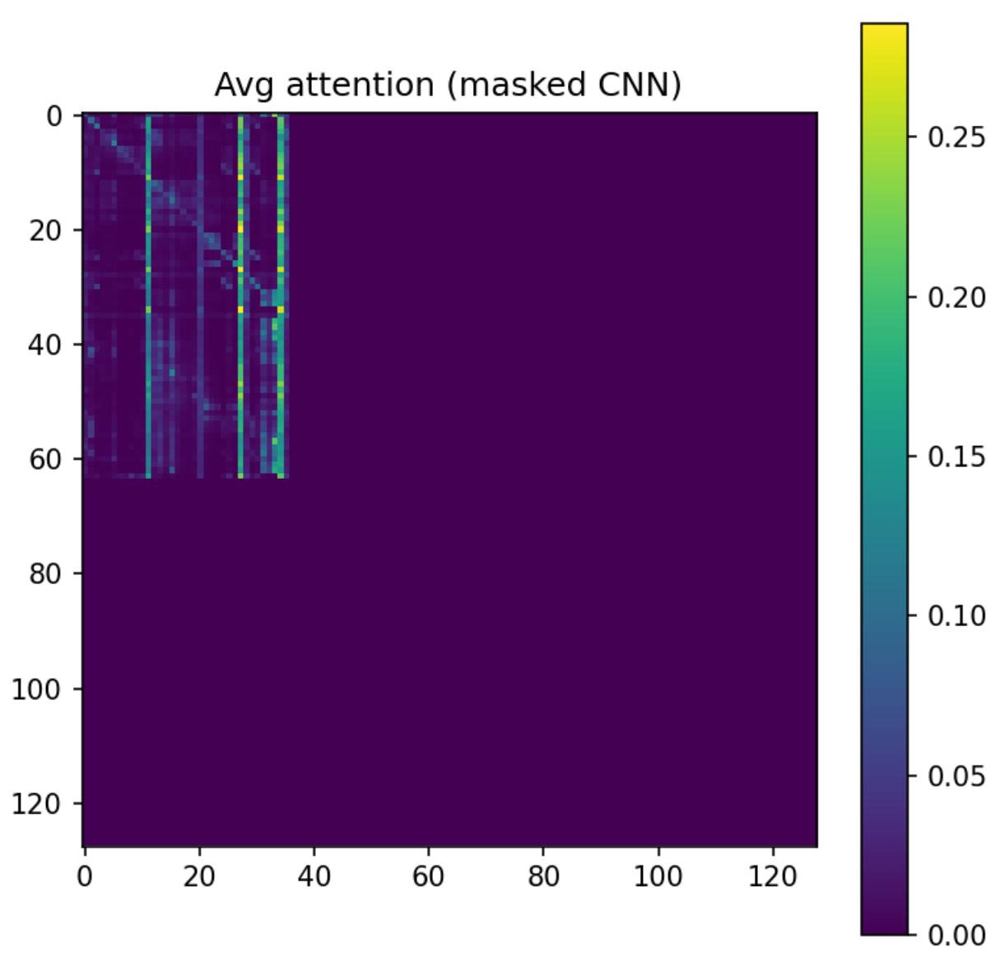

# ALCNet — Attention-Layer Convolution Network

Research platform for studying whether the 2D spatial geometry of transformer attention maps contains discriminative signal complementary to the CLS representation. Evaluated on GLUE RTE (binary textual entailment; 2,490 train / 277 validation examples).

---

## Contents

1. [Motivation](#motivation)
2. [Architecture](#architecture)
3. [Mathematical Formulation](#mathematical-formulation)
4. [Results and Ablations](#results-and-ablations)
5. [Installation](#installation)
6. [Training: CLI](#training-cli)
7. [Training: API + Worker](#training-api--worker)
8. [API Reference](#api-reference)
9. [Config Knobs](#config-knobs)
10. [Tests](#tests)
11. [Visualizations](#visualizations)
12. [Limitations and Open Problems](#limitations-and-open-problems)
13. [Roadmap](#roadmap)
14. [Appendix: Mathematical Formulation Details](#appendix-mathematical-formulation-details)

---

## Motivation

In standard classification fine-tuning, the full $(B, H, S, S)$ attention tensor is discarded and only the CLS representation is routed to the classifier head. The question this project asks: *does the 2D spatial structure of attention — which heads attend locally vs. globally, how asymmetric cross-token attention is, how concentrated the head distributions are — contain discriminative signal that is not already captured by the CLS vector?*

This is a hypothesis being tested, not a claim established by results. The architecture is designed to allow a controlled study of that question by building a parallel CNN branch over attention maps and measuring whether it contributes signal the CLS head cannot provide.

---

## Architecture

```
Input: (premise, hypothesis) token pair
  │
  ▼
EncoderWrapper  [RoBERTa-large, output_attentions=True]
  ├─ Weighted CLS pool: last 4 hidden layers, learned weights → CLS ∈ R^1024
  └─ Attention tensors: all 24 layers (B, H, S, S), H=16, S≤128
       │
       ├─ Branch 1 ─────────────────────────────────────────────────────────────────┐
       │   CLS → Linear(1024, 2) → vanilla_logits                                   │
       │                                                                             │
       ├─ Branch 2 ──────────────────────────────────────────────────────────────┐  │
       │   attn[layers -3,-2,-1] → build_attn_tensor                             │  │
       │   → (B, n_heads × len(attn_layers), S, S)  [default: (B, 48, 128, 128)] │  │
       │   → AttnCNN → 256-d features → cnn_feat                                 │  │
       │                                                                          │  │
       ├─ Branch 3 ───────────────────────────────────────────────┐              │  │
       │   attn tensors → attn_stats() → 21-d → MLP → 128-d      │              │  │
       │                   └── FiLMGenerator(21→γ,β per CNN stage)┤              │  │
       │                                                           │              │  │
       │                                       concat(cnn_feat, stats_feat) 384-d │  │
       │                                                → cnn_head → cnn_logits  │  │
       │                                                → conf_head → gate σ ────┘  │
       │                                                                             │
       └─ Fusion ────────────────────────────────────────────────────────────────────┘
           logits = (1 - gate) * vanilla_logits + gate * cnn_logits
```

### Sub-modules

**EncoderWrapper**
- RoBERTa-large (`roberta-large`) with `output_attentions=True`, `attn_implementation="eager"`.
- Learnable layer-weight vector of size 4; softmax-normalized before pooling CLS from the last 4 hidden states.
- Optional gradient checkpointing (`gradient_checkpointing=True` by default).

**AttnCNN**
- 1×1 channel adapter: $(B, C_{in}, S, S) \to (B, 64, S, S)$, where $C_{in} = n\_heads \times |\text{attn\_layers}|$.
- Stage 1: ConvBlock(64→128, 3×3) + SEBlock(128) + DropPath + residual shortcut.
  Full ConvBlock sequence: Conv2d → BatchNorm2d → FiLM(γ₁, β₁) → GELU → Dropout2d.
- Stage 2: MaxPool2d(2) → ConvBlock(128→256, 3×3) + SEBlock(256) + DropPath + residual shortcut.
  Full ConvBlock sequence: Conv2d → BatchNorm2d → FiLM(γ₂, β₂) → GELU → Dropout2d.
- Dual-pool head: learned scalar gate blends AdaptiveAvgPool2d and AdaptiveMaxPool2d.
- FC: Linear(256, 256).
- ConvBlock supports optional depthwise-separable mode (`depthwise_sep=True`).

**SEBlock** — squeeze-and-excitation channel recalibration: global average pool → Linear(C, C//4) → GELU → Linear(C//4, C) → Sigmoid → channel-wise scale.

**DropPath** — stochastic depth on residual branches; per-sample Bernoulli mask during training.

**FiLMGenerator** — maps the stats vector to per-channel $(\gamma, \beta)$ for each CNN stage:
- Stage 1: Linear(stats\_dim, 128×2) → $(\gamma_1, \beta_1) \in \mathbb{R}^{128}$ each.
- Stage 2: Linear(stats\_dim, 256×2) → $(\gamma_2, \beta_2) \in \mathbb{R}^{256}$ each.
- Bias initialized so $\gamma \approx 1$, $\beta \approx 0$ (identity at init).

**MLP (stats branch)** — LayerNorm(stats\_dim) → Linear(stats\_dim, max(128, stats\_dim//2)) → GELU → Dropout(0.1) → Linear → 128-d. With default stats\_dim=21: hidden size = 128.

**Confidence gate** — Linear(384, 1) with bias initialized to −2.0 (gate ≈ 0.12 at init, CLS-dominant). Sigmoid output logged per epoch.

**ModelEMA** — exponential moving average over all named parameters, applied during validation when `ema_decay > 0`. Context-manager-based weight swap.

### Attention Statistics (attn\_stats)

Runs under `@torch.no_grad()` — statistical features receive no gradient signal. Input: attention tensors from selected layers, each $(B, H, S, S)$; RoBERTa-large softmax outputs where each row already sums to 1. Output: $(B, \text{stats\_dim})$.

**Per selected layer** $\ell$ (6 features × L layers; default L=3, indices −3,−2,−1):

| Index | Feature | Definition |
|---|---|---|
| 0 | Long-range ratio | $\text{mean}_h \left[\frac{\sum_{i,j: \|i-j\|\geq 5} A_{h,ij}}{\sum_{ij} A_{h,ij}}\right]$ |
| 1 | CLS-in attention | $\text{mean}_{h,i} \, A_{h,i,0}$ — mean attention directed at token 0 (CLS) |
| 2 | Entropy mean | $\text{mean}_{h,i} \left[-\sum_j A_{h,ij} \log A_{h,ij}\right]$ — per-row entropy, averaged over heads and query positions. Note: $A_{h,ij}$ are already row-softmaxed. |
| 3 | Entropy std | $\text{std}_h \left[\text{mean}_i \left(-\sum_j A_{h,ij} \log A_{h,ij}\right)\right]$ — std of per-head mean entropy across H heads |
| 4 | Max-row attention | $\text{mean}_{h,i} \left[\max_j A_{h,ij}\right]$ — mean per-row peak (no additional normalization; rows already sum to 1) |
| 5 | Asymmetry | $\text{mean}_h \left[\|A_h - A_h^T\|_1\right]$ — mean absolute element-wise asymmetry across heads (unnormalized; sequence length is constant per batch) |

**Global features** from the last selected layer (the final element of the sorted index list; default: layer −1):

| Index | Feature | Definition |
|---|---|---|
| 6L | Diagonal mass | $\frac{\sum_{i} A_{ii}}{\sum_{ij} A_{ij}}$ — self-attention fraction |
| 6L+1 | Off-diagonal mass | $1 - \text{diag\_mass}$ |
| 6L+2 | Effective head count | Fraction of heads where per-head off-diagonal mass $> 0.60$ |

With default `attn_layers = (-3, -2, -1)`, `stats_dim = 6×3 + 3 = 21`.

---

## Results and Ablations

> **GLUE RTE validation** (277 examples, 2-class; 2,490 train examples).
>
> **Majority-class baseline**: the RTE training split is ~66% entailment, giving a majority-class classifier approximately 53–54% on the validation set. The current full-model result (52.71%) is **at or below this level** — the model has not yet learned task-relevant structure in this configuration.
>
> **RoBERTa-large standard fine-tuning**: ~86–88% (Liu et al., 2019). This comparison is not controlled: Liu et al. fine-tune end-to-end with standard CE loss; the results below use a different training regime (hybrid loss, partially-frozen encoder). The 34-point gap cannot be attributed to architecture alone.

### Hyperparameters for main result (52.71%)

Obtained with default `AlcnetCfg`: epochs=3, batch\_size=8, max\_len=128, lr\_encoder=8e-6, lr\_head=3e-4, weight\_decay=1e-4, label\_smoothing=0.05, rdrop\_alpha=0.0, no freeze, no EMA, gradient\_checkpointing=True.

### Branch ablation (partial)

| Variant | val\_acc | Note |
|---|---|---|
| Full model (CLS + CNN + Stats + FiLM) | 52.71% | At or below majority-class baseline |
| `no_cnn` (CLS branch only) | 47.29% | −5.42 pts; below majority-class |
| `no_stats` (FiLM still active, stats MLP zeroed) | — | Not yet run |
| `no_film` (CNN without FiLM conditioning) | — | Not yet run |

The `no_stats` and `no_film` ablations have not been run; these conditions directly test the two novel components. The +5.42 pt delta for the full model over `no_cnn` is not statistically significant at n=277 (SE ≈ 3 pts). Both results are below the majority-class baseline. **Missing baseline**: mean-pooling of the final encoder layer has not been tested; it consistently outperforms CLS-only on small datasets and would be a more informative lower bound.

### Linear probe analysis

Features from the best checkpoint (same run as the 52.71% result); probed with `sklearn.linear_model.LogisticRegression` (L2, lbfgs, default C=1.0). Probe trained on the 2,490-example training split, evaluated on the 277-example validation split. Encoder frozen throughout probe training.

| Probe | Accuracy |
|---|---|
| CNN features (256-d) | 52.71% |
| CLS (128-d projected) | 50.90% |
| Stats only (21-d) | **55.60%** |
| CNN + CLS | 53.43% |
| CNN + Stats | **57.04%** |
| CLS + Stats | 52.35% |
| CNN + CLS + Stats | 54.51% |

Stats-only probing (55.60%) outperforms the full end-to-end model (52.71%), which is not expected — it suggests the training loop is not exploiting the available feature information. The CNN+Stats linear probe delta over Stats-only is +1.44 pts, within the SE of ~3 pts at this sample size. CNN+CLS (53.43%) barely exceeds CNN-only (52.71%), suggesting the CLS and CNN features are not strongly complementary in this checkpoint. All margins are below statistical significance at n=277.

### CNN feature variance

| Metric | Value |
|---|---|
| Mean variance across 256 CNN dims | 0.000503 |

Near-zero CNN feature variance indicates the branch produces near-constant outputs across inputs — consistent with representational collapse rather than discriminative CNN features. The linear probe result for CNN+Stats reflecting primarily the Stats contribution (rather than the CNN) is consistent with this.

---

## Installation

**Requirements**: Python ≥ 3.10, Redis (for API/worker mode only).

```bash
pip install -e ".[dev]"
pip install honcho   # required for 'make up'; not included in pyproject.toml dev extras
```

Runtime and dev dependencies declared in `pyproject.toml`:
- `torch>=2.0`, `transformers>=4.30`, `datasets>=2.14`
- `fastapi`, `uvicorn`, `celery[redis]`, `sqlalchemy>=2.0`, `pydantic>=2.0`
- `scikit-learn>=1.3`, `numpy>=1.24`, `tqdm>=4.60`
- Dev: `pytest>=7.4`, `pytest-cov>=4.1`, `httpx>=0.25`, `ruff>=0.4`, `mypy>=1.8`

Redis (API/worker mode only):

```bash
sudo apt install redis-server
```

RoBERTa-large downloads from HuggingFace Hub on first run (~1.4 GB). Set `HF_HOME` or `TRANSFORMERS_CACHE` to control cache location.

**Reproducibility note**: `torch.backends.cudnn.benchmark = True` is set at startup, which selects fastest kernels by input shape and may produce non-deterministic results across runs with variable-length sequences. For strict reproducibility: set `benchmark=False` and `torch.use_deterministic_algorithms(True)`.

---

## Training: CLI

```bash
cat > run.json << 'EOF'
{
  "epochs": 5,
  "batch_size": 8,
  "max_len": 128,
  "gradient_checkpointing": true,
  "save_artifacts": true,
  "save_dir": "/tmp/alcnet_run1",
  "overrides": {
    "lr_encoder": 8e-6,
    "lr_head": 3e-4,
    "rdrop_alpha": 0.1,
    "ema_decay": 0.999,
    "freeze_encoder_epochs": 1
  }
}
EOF

python -m src.runner --infile run.json --run-id exp01 --save-dir /tmp/alcnet_run1 --progress-file /tmp/progress.jsonl
```

Per-epoch metrics are written as JSON lines to `--progress-file`. Final report saved to `<save_dir>/report.json`. Checkpoint saved to `<save_dir>/model.pt` when `save_artifacts=true`.

### Ablation modes

Add `"ablation"` key to the JSON payload:
- `"no_cnn"` — CLS branch only; no CNN or stats
- `"no_film"` — CNN without FiLM conditioning from stats
- `"no_stats"` — zeros the stats MLP output going to the classification head; FiLM conditioning from the stats vector remains active in the CNN

---

## Training: API + Worker

Three processes: Redis broker, FastAPI server, Celery worker.

```bash
make up        # starts all three via honcho + Procfile.dev
make redis     # redis-server on port 6379
make api       # uvicorn on port 8000
make worker    # celery worker (solo pool, PyTorch-safe)
```

Port overrides:

```bash
REDIS_PORT=6380 API_PORT=8010 make up
```

Submit a run:

```bash
curl -X POST http://localhost:8000/runs \
  -H "Content-Type: application/json" \
  -d '{"epochs": 3, "batch_size": 8, "gradient_checkpointing": true,
       "overrides": {"lr_encoder": 8e-6, "ema_decay": 0.999}}'
# {"run_id": "...", "task_id": "...", "status": "QUEUED"}
```

Poll progress:

```bash
curl http://localhost:8000/runs/<run_id>
```

---

## API Reference

| Method | Path | Description |
|---|---|---|
| GET | `/` | Service info |
| GET | `/health` | CUDA availability, device name, torch version |
| POST | `/runs` | Submit training run |
| GET | `/runs` | List runs. Query: `limit` (default 50), `status` |
| GET | `/runs/{run_id}` | Full run record: config, epoch logs, artifacts, result |

### POST /runs — request schema

```json
{
  "epochs":                 3,
  "batch_size":             8,
  "max_len":                128,
  "gradient_checkpointing": true,
  "save_artifacts":         false,
  "save_dir":               null,
  "device":                 null,
  "ablation":               null,
  "overrides":              {}
}
```

`overrides`: keys matching `AlcnetCfg` fields are applied; unknown keys are silently ignored with a warning log.

### GET /runs/{run_id} — response shape

```json
{
  "run_id": "...",
  "status": "COMPLETE",
  "best_val_acc": 0.5271,
  "epochs_log": [
    {
      "epoch": 1,
      "train_loss_ema": 0.693,
      "train_acc":      0.521,
      "val_acc":        0.501,
      "val_f1_macro":   0.498,
      "lr":             null,
      "gates":          {"gate_mean": 0.14, "grad_norm": 0.93},
      "time_sec":       142.3
    }
  ],
  "artifacts": [
    {"kind": "checkpoint", "path": "...", "bytes": 1473221632},
    {"kind": "report",     "path": "...", "bytes": 4192}
  ],
  "result": {"best": {"val_acc": 0.5271, "epoch": 3}}
}
```

Note: `lr` in `epochs_log` is always `null` — the training loop emits `lr_encoder`/`lr_head` separately, captured under `gates` rather than the dedicated `lr` column. Known schema mismatch; see Roadmap.

---

## Config Knobs

| Field | Default | Description |
|---|---|---|
| `model_name` | `"roberta-large"` | HuggingFace model identifier |
| `task_name` | `"rte"` | GLUE task name |
| `max_len` | 128 | Max token sequence length |
| `batch_size` | 8 | Per-device batch size |
| `epochs` | 3 | Training epochs |
| `lr_head` | 3e-4 | Learning rate for classifier head |
| `lr_encoder` | 8e-6 | Learning rate for encoder |
| `weight_decay` | 1e-4 | AdamW weight decay |
| `label_smoothing` | 0.05 | Base smoothing $\epsilon$ (anneals from 2ε to ε over training) |
| `rdrop_alpha` | 0.0 | R-Drop KL coefficient; 0 disables. Note: with frozen encoder layers, R-Drop measures stochasticity only in unfrozen params. |
| `grad_clip` | 1.0 | Max norm for joint grad clipping (encoder + head combined) |
| `grad_accumulation_steps` | 1 | Accumulate gradients before optimizer step |
| `attn_layers` | `(-3, -2, -1)` | Layer indices for attention extraction (negative = from end) |
| `attn_size` | 128 | Spatial size after bilinear interpolation |
| `attn_drop` | 0.0 | Random element dropout on attention maps during training |
| `warmup_ratio` | 0.06 | Fraction of total steps for linear LR warmup |
| `lr_schedule` | `"cosine"` | `"cosine"` or `"cosine_restarts"` (per-epoch restart) |
| `early_stopping_patience` | 0 | Stop after N epochs without val\_acc improvement; 0 = off |
| `gradient_checkpointing` | True | Trade compute for memory in encoder |
| `compile_model` | False | `torch.compile()` the GatedHybridClassifier (not the encoder; PyTorch 2.0+) |
| `ema_decay` | 0.0 | EMA decay; 0 = off; 0.999 typical if enabled |
| `freeze_encoder_epochs` | 0 | Freeze encoder for first N epochs then unfreeze |
| `ablation` | None | `"no_cnn"` / `"no_stats"` / `"no_film"` |
| `hidden_dropout` | None | Override encoder hidden/attention dropout |
| `seed` | 42 | Global random seed (note: `cudnn.benchmark=True` may limit full determinism) |
| `max_train_samples` | None | Cap training set size |
| `max_val_samples` | None | Cap validation set size |

### Recommended starting config (24 GB GPU)

```json
{
  "epochs": 10,
  "batch_size": 16,
  "gradient_checkpointing": true,
  "overrides": {
    "lr_encoder": 8e-6,
    "lr_head": 3e-4,
    "weight_decay": 1e-4,
    "rdrop_alpha": 0.1,
    "ema_decay": 0.999,
    "freeze_encoder_epochs": 2,
    "early_stopping_patience": 3,
    "attn_drop": 0.05,
    "label_smoothing": 0.05
  }
}
```

---

## Tests

130+ assertions across 7 test modules:

| Module | Covers |
|---|---|
| `test_models.py` | `DropPath`, `SEBlock`, `ConvBlock`, `AttnCNN`, `GatedHybridClassifier`, `ModelEMA`, all three ablation paths |
| `test_attention.py` | `build_attn_tensor`: normalization, bilinear resize, `attn_drop` augmentation |
| `test_film.py` | `FiLMGenerator` shapes, init (γ≈1, β≈0), `apply_film` broadcast |
| `test_config.py` | `AlcnetCfg` defaults, `parse_layers` negative-index resolution |
| `test_db.py` | Run creation, status transitions, epoch append, artifact registration, `serialize_run` |
| `test_api.py` | Endpoint contracts: `/`, `/health`, `POST /runs`, `GET /runs`, `GET /runs/{run_id}` |
| `test_runner.py` | `run_from_req` override application, unknown key rejection |

```bash
pytest
pytest tests/test_models.py
pytest --tb=short -q
pytest --cov=src --cov-report=term-missing
```

---

## Visualizations

<p align="center">
  
</p>

**Figure 1**: CNN activation heatmap over the attention map from layer 23, head 0. Bright regions indicate positions where the CNN assigns high activation. The spatial concentration suggests the CNN output is sensitive to particular structure in the attention map; whether this reflects a learned discriminative pattern or a training artifact is unclear at current accuracy levels.

<p align="center">
  
</p>

**Figure 2**: CNN activation map under inference-time selective masking — only the top-left patch of the attention tensor is unmasked. Discriminative signal concentrates in the visible region. This demonstrates input sensitivity of the CNN output; it does not demonstrate training-time gradient flow into the encoder's Q/K/V projections.

---

## Limitations and Open Problems

### Architecture design choices with known tradeoffs

- **`attn_stats` runs under `@torch.no_grad()`**: Statistical features receive no gradient from the classification loss. This prevents the stats MLP from adapting toward discriminative structure. Intentional (for efficiency and stability), but it limits what the stats branch can learn.
- **Gate initialized CNN-skeptical** (`bias = -2.0`, $g \approx 0.12$): The CNN branch must produce useful signal before the gate opens, but will not receive meaningful gradient if the gate is always near zero. Convergence gate value has not been measured in reported runs.
- **`no_stats` ablation leaves FiLM active**: Zeroing the stats MLP output does not disable FiLM conditioning in the CNN — the stats vector still modulates CNN feature maps. The `no_stats` condition tests "stats contribution to the classification head" not "stats contribution overall."

### Empirical failure modes

- **At or below majority-class baseline**: The full model at 52.71% is not above the ~53–54% majority-class classifier on RTE. The model has not established that it is learning task-relevant structure.
- **Low CNN feature variance** (mean 0.0005 across 256 dims): The CNN branch output is near-constant across inputs. The +1.44 pt linear probe improvement from CNN+Stats over Stats-only is not distinguishable from noise, and likely reflects Stats alone.
- **Linear probe outperforms end-to-end**: Stats-only linear probing (55.60%) exceeds the full end-to-end model (52.71%), indicating the training loop is not exploiting available feature information.
- **No missing ablations run**: The two most important ablations (`no_stats`, `no_film`) have not been completed. Neither has a mean-pooling baseline, which would be a more informative lower bound than CLS-only.

### What would falsify the hypothesis

The central hypothesis — that attention geometry provides signal complementary to CLS — would be falsified if: (a) `no_cnn` and full model converge to the same accuracy under matched hyperparameters with a well-trained encoder, and (b) linear probing of CNN features after full encoder fine-tuning shows no accuracy gain over CLS or mean-pool. Neither condition has yet been tested.

### Research questions this platform enables

1. Does the CNN branch contribute once the encoder is properly fine-tuned (more epochs, higher `lr_encoder`)?
2. Does the gate value converge above 0.5 for any configuration?
3. Which `attn_layers` settings produce the most geometrically diverse attention maps for entailment?
4. Do individual `attn_stats` dimensions correlate with linguistic properties (long-range dependency, focus, syntactic asymmetry)?
5. Does FiLM conditioning improve CNN feature alignment (measured by CKA) across checkpoints?

---

## Roadmap

Priority ordered by proximity to validating the core hypothesis:

- [ ] Run missing ablations: `no_stats`, `no_film`, mean-pool baseline
- [ ] Measure convergence gate value — establish whether the CNN branch is ever weighted above 0.5
- [ ] Full encoder fine-tuning run: epochs=10, unfreeze from epoch 1, higher `lr_encoder`
- [ ] Fix DB schema: persist `lr_encoder`, `lr_head`, `gate_mean`, `grad_norm` as dedicated columns
- [ ] Address CNN feature collapse: auxiliary CNN loss, higher `lr_head`, or deeper CNN
- [ ] Inference script: load checkpoint, predict single (premise, hypothesis) pair, return label + gate
- [ ] Optional in-graph `attn_stats` (flag to remove `@torch.no_grad()`, measure gradient stability)
- [ ] Extend to MNLI, QNLI — test whether attention geometry is more discriminative on other tasks
- [ ] `torch.compile()` validation (`compile_model=False` default; GatedHybridClassifier only, encoder excluded)
- [ ] W&B / MLflow integration for hyperparameter sweep tracking

---

## Appendix: Mathematical Formulation Details

### Attention tensor construction

Let $\mathcal{A}_\ell \in \mathbb{R}^{B \times H \times S \times S}$ be the attention tensor at layer $\ell$. For selected layers $\mathcal{L} = \{l_1, \ldots, l_L\}$:

$$X = \text{concat}_{\ell \in \mathcal{L}} \, \mathcal{A}_\ell \in \mathbb{R}^{B \times LH \times S \times S}$$

Channel-normalize: $X \leftarrow (X - \mu_c) / (\sigma_c + \epsilon)$, statistics over spatial dimensions $(S, S)$ per channel per sample.

### FiLM conditioning

Statistical features $s \in \mathbb{R}^{\text{stats\_dim}}$ generate per-channel scale and shift. Applied within ConvBlock after BN, before activation (Conv → BN → FiLM → GELU → Dropout):

$$(\gamma^{(k)}, \beta^{(k)}) = W^{(k)} s + b^{(k)}, \quad k \in \{1, 2\}$$

$$\tilde{x} = \gamma^{(k)} \cdot x + \beta^{(k)}$$

$\gamma, \beta$ broadcast over spatial dimensions.

### Gated fusion

$f_\text{cnn} \in \mathbb{R}^{256}$, $f_\text{stats} \in \mathbb{R}^{128}$, $W_g \in \mathbb{R}^{1 \times 384}$:

$$g = \sigma(W_g [f_\text{cnn}; f_\text{stats}] + b_g), \quad b_g = -2.0$$

$$\hat{y} = (1 - g) \cdot v + g \cdot c$$

### CLS pooling

$$\text{CLS} = \sum_{i=1}^{N} \tilde{w}_i \cdot h_i^{[0]}, \quad \tilde{w} = \text{softmax}(w), \quad w \in \mathbb{R}^N, \; N=4$$

### R-Drop regularization

Two stochastic forward passes (different dropout masks) produce $p_1, p_2$. Note: with frozen encoder layers, dropout is inactive in those layers, so $p_1$ and $p_2$ differ only in the unfrozen components.

$$\mathcal{L}_\text{RDrop} = \frac{1}{2} \left( D_\text{KL}(p_1 \| p_2) + D_\text{KL}(p_2 \| p_1) \right)$$

$$\mathcal{L} = \frac{1}{2}(\mathcal{L}_\text{CE}(p_1) + \mathcal{L}_\text{CE}(p_2)) + \alpha \cdot \mathcal{L}_\text{RDrop}$$

Implementation: `F.kl_div(..., log_target=True)` with log-softmax inputs on both sides.

### Label smoothing annealing

At epoch $e$ of $E$ total ($E \geq 2$; for $E=1$, denominator treated as 1):

$$\epsilon_e = \epsilon \cdot \left(2 - \frac{e-1}{E-1}\right), \quad \epsilon_e \leq 0.5$$

### Learning rate schedule

$$\lambda(t) = \begin{cases} t / t_\text{warm} & t < t_\text{warm} \\ \frac{1}{2}\left(1 + \cos\left(\pi \frac{t - t_\text{warm}}{T - t_\text{warm}}\right)\right) & \text{otherwise} \end{cases}$$

`lr_schedule = "cosine_restarts"`: cosine period resets every epoch.

---

## Citation

No associated paper. Reference the repository directly if the `attn_stats` feature set is useful for your work.

---

## License

MIT. See `LICENSE`.

**Author**: Srinivas Harish
