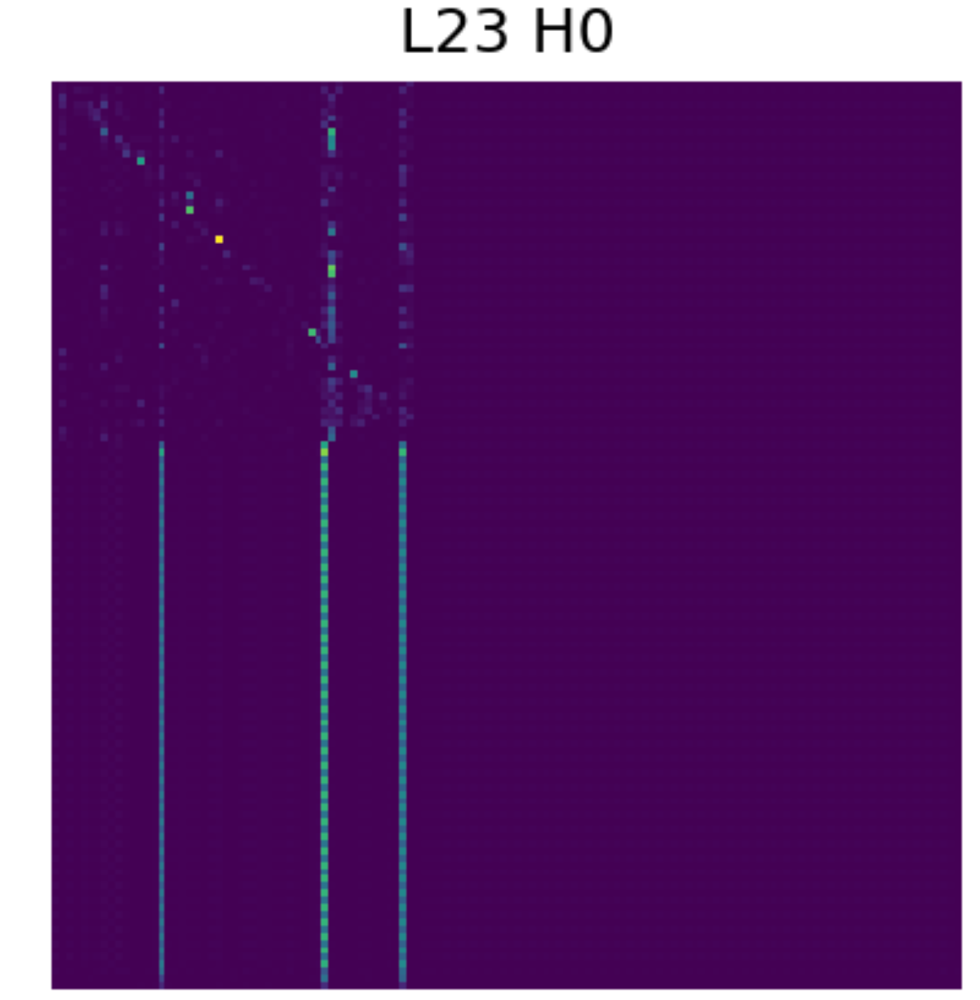

# ALCNet: Attention-Layer Convolutional Net with FiLM Conditioning

Convolutional processing of multi-head attention tensors (spatial S×S, 1×1 head-mix, 1D layer conv) with residual fusion.
We leverage multiple modalities (CLS, attention-CNN, statistical features) with the idea that the CNN branch does not just “read” attention but **reshapes transformer expressivity via backprop**, while **FiLM adds soft conditioning** so Stats dynamically modulate CNN activations.

## 2. Model Architecture

- **Backbone**: Transformer encoder (e.g., BERT/Roberta).  
- **Branches**:
  - **CLS probe**.
  - **CNN on attention maps**, modulated via FiLM.
  - **Statistical features** (21-d handcrafted + perplexity), feeding into FiLM conditioning and an auxiliary MLP.
- **Fusion via FiLM**:
  - Stats network generates γ, β parameters.
  - FiLM applied at CNN intermediate layers (γ·x+β).
  - Produces adaptive, conditional CNN features.
- **Final head** = concatenated branches → classifier.

---

## 3. Heatmap Visualizations (Mechanistic Evidence)

Heatmaps show **where the CNN is applying pressure** on the attention maps.  
When training under selective masking (e.g., only top-left patch unmasked), the CNN’s activation maps and the transformer's useful expressivity collapses into that region, demonstrating that:

- Gradients flow back from CNN → transformer Q/K/V → attention allocation.  
- Transformer reallocates discriminative signal into the **only visible patch**.  
- Other attention regions (masked) carry no useful task signal after training.  

  

Figure 1: CNN activation heatmap. Bright regions = discriminative attention patches CNN forced transformer to expose.

  

Figure 2: Masked CNN heatmap. Only top-left patch unmasked, collapsing useful transformer expressivity to that region.

---

## 4. Statistical Evidence 

- **CNN adds expressivity**: –5.4 pts when biased towards CLS only. The CNN branch is carrying most of the load.  

---

### Validation Ablations

| Model Variant        | Accuracy | Δ vs Full |
|----------------------|----------|-----------|
| Full model           | 52.71%   | –         |
| Minus CNN branch     | 47.29%   | –5.42 pts |
| Minus CLS branch     | 52.71%   | +0.00 pts |

---

### Cross-Branch Dependence

| Metric                  | Value  |
|--------------------------|--------|
| RV(CNN, CLS)             | 0.4367 |
| RV(CNN, Stats)           | 0.6492 |
| Norm corr(CNN, CLS)      | 0.5035 |
| Norm corr(CNN, Stats)    | 0.6189 |
| CCA mean corr(CNN, CLS)  | 0.5553 |
| CCA mean corr(CNN, Stats)| 0.7743 |

---

### Feature Variance

| Metric                        | Value   |
|-------------------------------|---------|
| Mean variance across 256 dims | 0.000503|

---

### Linear Probes (frozen features)

| Probe Variant     | Accuracy |
|-------------------|----------|
| CNN-only (256)    | 52.71%   |
| CLS-only (128)    | 50.90%   |
| Stats-only (128)  | 55.60%   |
| CNN+CLS           | 53.43%   |
| CNN+Stats         | 57.04%   |
| CLS+Stats         | 52.35%   |
| CNN+CLS+Stats     | 54.51%   |

 
---

## 5. FiLM Conditioning Mechanism 

 
---

## 6. Mechanism of Gradient Flow

 
---

## 7. Mathematical Derivation (Chain Rule) 

 
---

## Full Ablations

 
---

## Discussion

---

